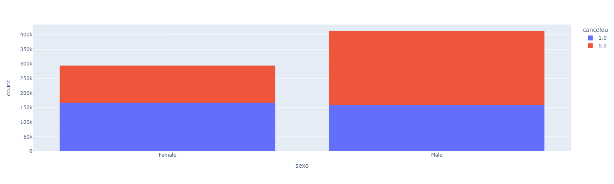

# Treinamento Python na Jornada Python da Hashtag Programação
## Case - Cancelamento de Clientes:
Neste repositório, você encontrará o código e informações referentes ao treinamento de Python realizado na Jornada Python da Hashtag Programação. O objetivo principal do treinamento foi resolver um desafiador case de análise de dados envolvendo o cancelamento de clientes em uma empresa com mais de 800 mil clientes.

## Descrição do Case:
A empresa contratante identificou que uma grande parte dos seus clientes está inativa, ou seja, já cancelou o serviço prestado. Para melhorar seus resultados e tomar ações mais eficientes, a empresa deseja compreender os principais motivos que levam ao cancelamento dos clientes. Para isso, foi solicitado ao nosso time de análise de dados que investigasse e elaborasse insights a partir dos dados disponíveis.

## Objetivos:
1. Identificar os principais motivos de cancelamento de clientes na base total de mais de 800 mil clientes.

## Bibliotecas Utilizadas:
```
$ pip install pandas plotly
```
- Pandas: Para manipulação e análise dos dados.
- Plotly: Para a criação de gráficos interativos e visualizações.

## Resultados Obtidos:

Após a realização da análise dos dados fornecidos, foram gerados histogramas e gráficos interativos que nos permitiram identificar os maiores motivos de cancelamento de clientes. As principais conclusões obtidas foram:

1. Forma de Pagamento Mensal: Os clientes que optaram por forma de pagamento mensal apresentaram uma taxa de cancelamento significativamente maior do que aqueles que escolheram outras formas de pagamento.

2. Dias de Atraso > 20: Foi observado que clientes com atrasos superiores a 20 dias possuem uma tendência maior de cancelar o serviço.

3. Ligações de Call Center >= 5: Clientes que realizaram 5 ou mais ligações para o call center antes de solicitar o cancelamento foram identificados como mais propensos a realizar o cancelamento.

Essas informações são de extrema importância para a empresa contratante, pois permitem traçar estratégias mais eficientes para reter os clientes e melhorar seus resultados.

### Conclusão:

Este treinamento proporcionou uma experiência valiosa em análise de dados com Python, utilizando as bibliotecas Pandas e Plotly. Através da análise dos principais motivos de cancelamento de clientes, pudemos contribuir para que a empresa tome decisões mais informadas e atue de forma proativa para aprimorar seus serviços e reduzir a taxa de cancelamentos.

Foi uma jornada desafiadora e recompensadora, e espero continuar a aprimorar minhas habilidades em Python e análise de dados para enfrentar novos desafios no futuro.

### Imagens:

A seguir, apresentamos as imagens geradas durante a análise:





### Resultado da Análise

A imagem abaixo mostra o print do resultado da análise dos dados:


